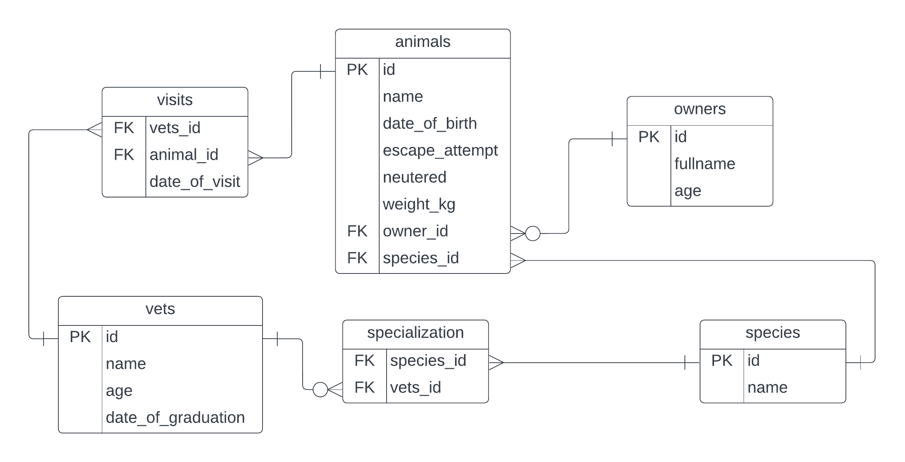

# Vet-clinic-database

> This project uses a relational database to create the initial data structure for a vet clinic. A table is crested to store animals' information, insert some data into it, and query it.

# SCHEMA


## Getting Started
### Prerequisites
- relational database
- SQL
- git

### Setup

To get a local copy up and running follow these simple example steps:

```
$ git clone git@github.com:tylher/vet-clinic-database.git
```

```
$ cd vet-clinic-database
```

### Usage
This repository includes files with plain SQL that can be used to recreate a database:

- Use [schema.sql](./schema.sql) to create all tables.
- Use [data.sql](./data.sql) to populate tables with sample data.
- Check [queries.sql](./queries.sql) for examples of queries that can be run on a newly created database. **Important note: this file might include queries that make changes in the database (e.g., remove records). Use them responsibly!**


## Authors

👤 **Author1**

- GitHub: [@tylher](https://github.com/tylher)
- Twitter: [@tylher123](https://twitter.com/tylher123)
- LinkedIn: [Taiwo Adediran](https://www.linkedin.com/in/taiwo-adediran-327654127/)

## 🤝 Contributing

Contributions, issues, and feature requests are welcome!

Feel free to check the [issues page](../../issues/).

## Show your support

Give a ⭐️ if you like this project!

## Acknowledgments

- Hat tip to anyone whose code was used
- Inspiration
- etc

## 📝 License

This project is [MIT](./MIT.md) licensed.
